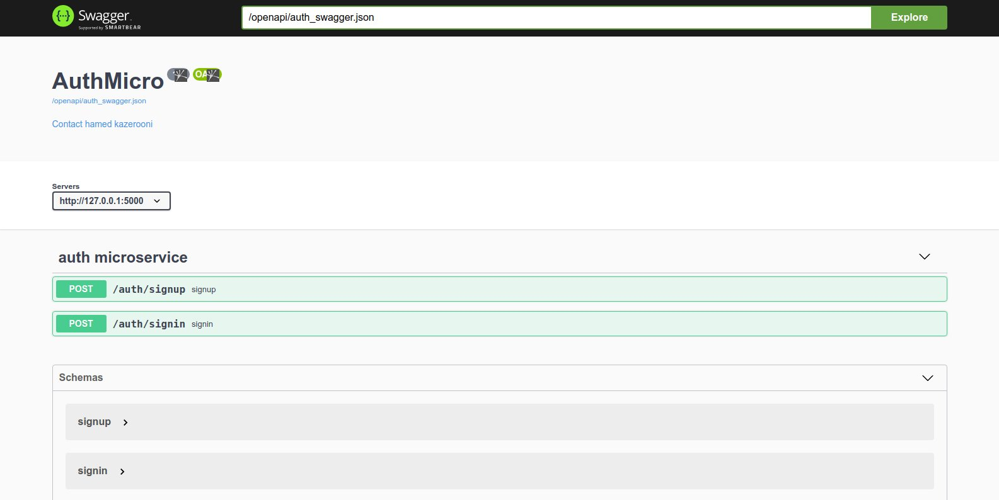

# FlaskAuth

FlaskAuth is a simple microservice that uses flask as it's core to handle:
* input validation using [jsonschema](https://python-jsonschema.readthedocs.io/en/stable/#) 
* sending emails
* generate jwt tokens

in order to achieve simple sign in and signup scenario.

## Prerequisites

Python3 is a must, and it's suggested to use Python3.6+ for running this microservice.

Install dependencies using **requirements.txt** provided in root directory of project.
```
pip install -r requirements.txt
```

## Configuration
In the **.env** file in root directory of project you'll see all configurations that can be changed by user.
```
SECRET_KEY = 
BACKEND_BASE_URL = 127.0.0.1:5000
SMTP_SALT = 
DEFAULT_SMTP_EMAIL = 
DEFAULT_SMTP_EMAIL_PASSWORD =
MAIL_SERVER = smtp.gmail.com
MAIL_SERVER_PORT = 587
```
Set proper and long **SECRET_KEY** for generating secure jwt token.

**BACKEND_BASE_URL** is domain name of backend service.

Setting **SMTP_SALT** will ensure more secure email generated tokens

Set configured email address for **DEFAULT_SMTP_EMAIL** to send emails using SMTP protocol. By *configured email* it
means **allow less secure app access** for provided email, if not this microservice will not work properly.


## Running
Since this project aims at design level, using this project for ___production___ environments is discouraged. For production purposes **gunicorn**, **docker** and high-end fast **database** are the minimum requirements.

In order to run project simply setup *.env* file and run following command inside root of project.

    //Linux
    [project_root_directory] :$ python3 app.py
    //Windows
    [project_root_directory] > python app.py

## Swagger

You can access swagger-ui provided to project services by accessing following url:
> 127.0.0.1:5000/docs


